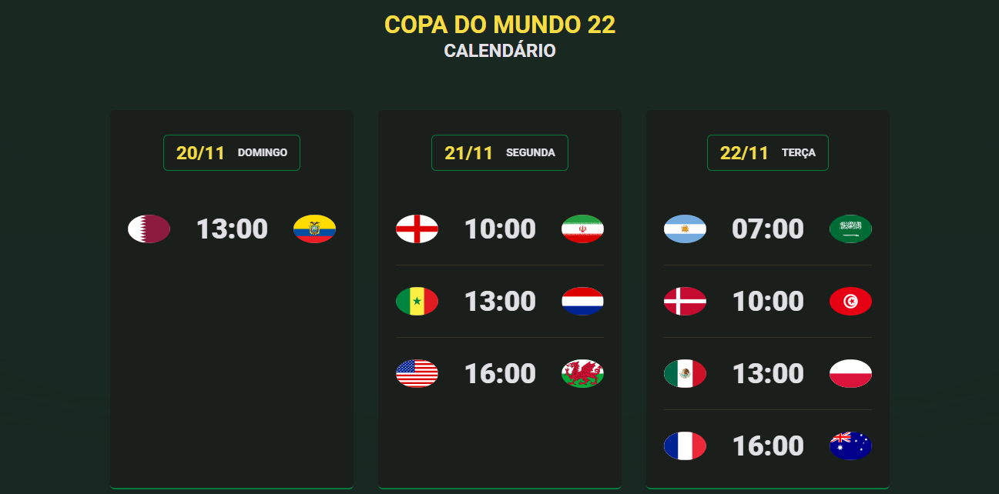

# Calendário - Copa do Mundo 2022

Projeto desenvolvido durante o NLW Copa - Explore. O projeto trás o calendário com os jogos da Copa do Mundo de 2022.

[Cliquei aqui para acessar](https://hashtagadotei.netlify.app/)

## 🛠️ Tecnologias

- HTML
- CSS
- JavaScript
- Git e Github

## 🚀 O que aprendi
- Aprendi sobre responsividade, transform, animação com CSS e criação de função e variável no JavaScript.

## 🖤 Contato

jmjuniormonteiro@gmail.com

https://www.linkedin.com/in/jmjuniordeveloper/

https://www.instagram.com/jmjuniordeveloper/
